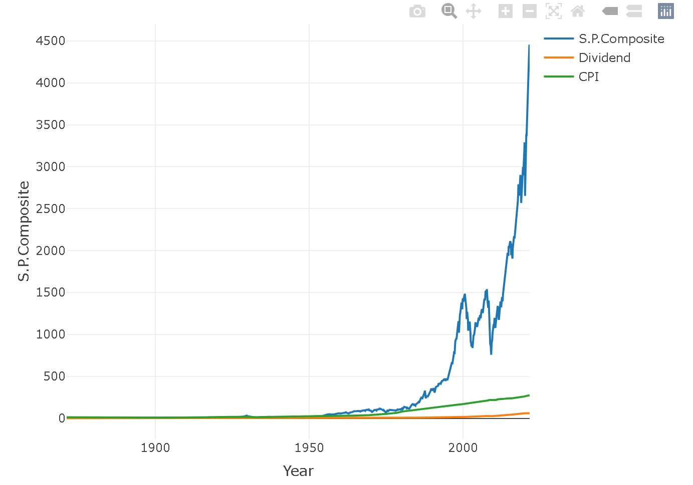

# Time Series Analysis Lab Repository

Welcome to the Time Series Analysis Lab repository! This repository contains a collection of 10 comprehensive time series analysis laboratory files implemented in R. Whether you're a beginner looking to dive into time series analysis or an experienced practitioner seeking to sharpen your skills, this repository offers a variety of hands-on labs to explore different aspects of time series data.

## Contents

1. **ARIMA Modeling**: Understand and implement Autoregressive Integrated Moving Average (ARIMA) models to analyze and forecast time series data.

2. **SARIMA Parameter Tuning**: Dive deeper into Seasonal ARIMA (SARIMA) models by learning how to tune model parameters for improved forecasting accuracy.

3. **Moving Average Plots**: Visualize and interpret moving average plots to identify trends and patterns in time series data.

4. **PACF and ACF Plots**: Explore Partial Autocorrelation Function (PACF) and Autocorrelation Function (ACF) plots to understand the autocorrelation structure of time series data.

5. **Interactive Visualizations**: Build interactive visualizations using R packages like ggplot2 and plotly to interactively explore and analyze time series data.

6. **Augmented Dickey-Fuller Test**: Perform the Augmented Dickey-Fuller test to assess the stationarity of time series data and understand its implications for modeling.

7. **Additional Time Series Techniques**: Discover and implement additional time series techniques to further enhance your understanding and analysis of time series data. 

8. **Lab Exercises and Solutions**: Engage in practical lab exercises provided with solutions to reinforce your learning and apply concepts covered in each lab.

9. **Data Sets**: Access sample time series data sets used in the labs to practice and experiment with various time series analysis techniques.

10. **Comprehensive Documentation**: Detailed documentation and explanations accompany each lab file, providing step-by-step instructions and insights into the underlying concepts and methodologies.

## How to Use

To get started, simply clone or download this repository to your local machine. Navigate to the lab files of interest and follow the instructions provided in the accompanying documentation. Execute the R scripts in your preferred R environment or IDE to run the analyses and explore the results. Feel free to modify the code and experiment with different parameters to deepen your understanding and tailor the analyses to your specific needs.

## Contributions

Contributions to this repository are welcome! If you have additional time series analysis techniques, lab exercises, or improvements to existing content, please feel free to submit a pull request. Together, we can create a valuable resource for the time series analysis community.
